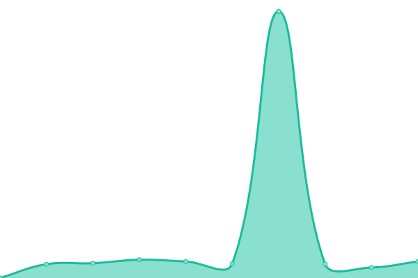
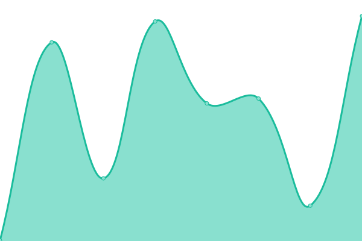

# [📈 Live Status](https://gyst.github.io/upptime/): <!--live status--> **🟩 All systems operational**

This repository contains the open-source uptime monitor and status page for [gyst's Upptime](https://gyst.github.io/upptime/), powered by [Upptime](https://github.com/upptime/upptime).

With [Upptime](https://gyst.github.io/upptime/), you can get your own unlimited and free uptime monitor and status page, powered entirely by a GitHub repository. We use [Issues](https://github.com/upptime/upptime/issues) as incident reports, [Actions](https://github.com/gyst/upptime-quaive/actions) as uptime monitors, and [Pages](https://gyst.github.io/upptime/) for the status page.

<!--start: status pages-->
<!-- This summary is generated by Upptime (https://github.com/upptime/upptime) -->
<!-- Do not edit this manually, your changes will be overwritten -->
<!-- prettier-ignore -->
| URL | Status | History | Response Time | Uptime |
| --- | ------ | ------- | ------------- | ------ |
|  [Quaive](https://quaive.com) | 🟩 Up | [quaive.yml](https://github.com/gyst/upptime/commits/HEAD/history/quaive.yml) | 

 829ms
     
 | 

<a href="https://gyst.github.io/upptime/history/quaive">100.00%</a>
    

|  [Cosent](https://cosent.nl) | 🟩 Up | [cosent.yml](https://github.com/gyst/upptime/commits/HEAD/history/cosent.yml) | 

 256ms
     
 | 

<a href="https://gyst.github.io/upptime/history/cosent">100.00%</a>
    

|  [Dark Edge](https://darkedge.world) | 🟩 Up | [dark-edge.yml](https://github.com/gyst/upptime/commits/HEAD/history/dark-edge.yml) | 

 298ms
     
 | 

<a href="https://gyst.github.io/upptime/history/dark-edge">100.00%</a>
    

<!--end: status pages-->

[**Visit our status website →**](https://gyst.github.io/upptime/)

## 📄 License

- Powered by: [Upptime](https://github.com/upptime/upptime)
- Code: [MIT](./LICENSE) © [Anand Chowdhary](https://anandchowdhary.com), supported by [Pabio](https://pabio.com)
- Data in the `./history` directory: [Open Database License](https://opendatacommons.org/licenses/odbl/1-0/)
